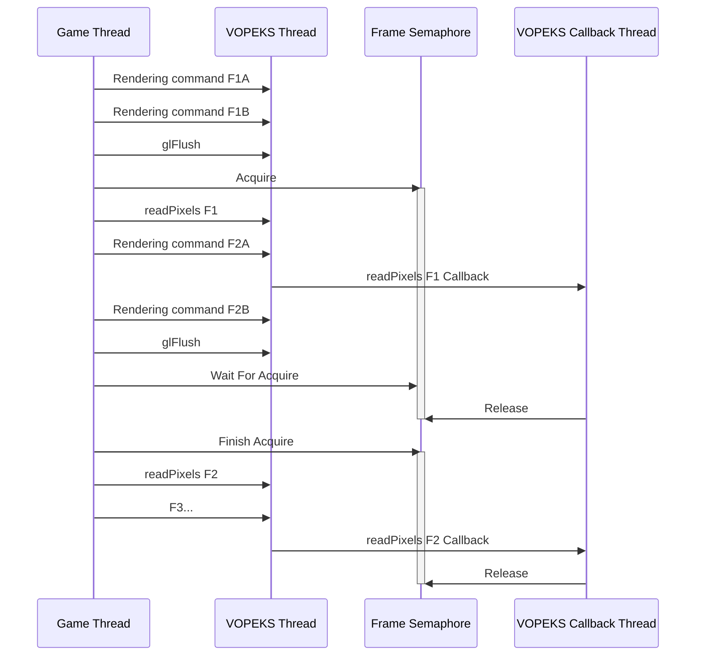

# VOPEKS : Or, How I Learned To Stop Worrying About Pipeline Stalls And Love glReadPixels

(Very Overengineered Picture Engine... and I'm not sure what to make the KS.)

## Base Layer

The base layer of VOPEKS is defined in the `gabien.vopeks.Vopeks` class and `gabien.IImage` interface, with `gabien.vopeks.VopeksFloatPool` as something which may get pushed upwards, perhaps as far as USLX.

`IImage` has things like width/height, and is responsible for containing the functions required to synchronize surface access in the presence of batching or batching-like features. It also contains a function to simply outright retrieve the `BadGPU.Texture` handle.

The `Vopeks` object itself contains the functions required to submit tasks to the VOPEKS or Callback threads.

User code therefore can use `IImage` to make sure different batchers cooperate, then submit a task to VOPEKS, pulling data from or pushing data to any surface that exposes this interface, including VOPEKS images. They can also do the inverse, providing their own surfaces to standard GaBIEn functions.

## Surface Synchronization

Because BadGPU is based on OpenGL, and OpenGL contexts have a single "caller thread" as a decently hard rule, VOPEKS works using a single task queue. However, care is still needed to ensure tasks are *submitted* to this queue in an order that is correct for the API guarantees.

In practice, this is effectively effortless *until* batching is introduced. (Multi-threaded access isn't, by itself, a concern, as in the non-batching case it is automatically synchronized by the task queue.) Batching delays the actual task submission time to after the image was passed into the API, and so tasks that modify the image could, without any synchronization, be submitted after the image was passed in, but before the batch is submitted.

To avoid this, `IImage` defines three main synchronization functions:

* `batchFlush`: Submits the current batch, if any.

* `batchReference`: Firstly, performs `batchFlush` (to ensure existing planned operations appear); then creates a reference to the callee from the caller (passed in). When an API request that modifies the callee comes in, `batchFlush` is called on the caller first. (This clears the references, because the point in time they target has now just passed.)
  
  * This is *not* task submission time! Remember, this synchronization is intended to provide a consistent view to API callers. `VopeksBatchingSurface` refers to flushing references to itself as `batchReferenceBarrier`, and runs it in `batchStartGroup`, which is run at API call time, but not at batch submit time. Operations that do directly submit tasks that modify the surface do run `batchReferenceBarrier` just before submit time.

* `batchUnreference`: Cancels a `batchReference`. Once a batch is submitted, it's no longer necessary for textures referred to by that batch to synchronize.

It's worth noting that if a surface is intended to be immutable, all of these operations can be (and are in `VopeksImage`) NOPs.

## Threading

VOPEKS assumes a multi-threaded user with no sense of restraint. It also assumes *really slow callbacks.* (This is a side-effect of how backends handle WSI. Backends are the one thing that uses callbacks, so this matters.)

In non-ideal circumstances (WSI-bottlenecked, which is the usual problem), the timings look something like this:

Notably, even in these circumstances, we're still able to perform actual rendering on the VOPEKS thread during WSI, depending on how quickly VOPEKS is completing readPixels requests. If we're bottlenecked by not being able to start readPixels until after WSI finishes, switching between buffers fixes that too, but that's not implemented yet and would change the timing diagram (it requires two semaphores).

Under ideal conditions, while the game thread is preparing rendering commands, the GPU and WSI work finishes, so we're never actually waiting on the semaphore. This means the game can output frames as fast (or as slow) as it wishes to prepare them. They'll all eventually reach the screen; their readPixels calls are kept in sequence by the VOPEKS thread, which also keeps their callbacks in sequence, which keeps their WSI in sequence.
