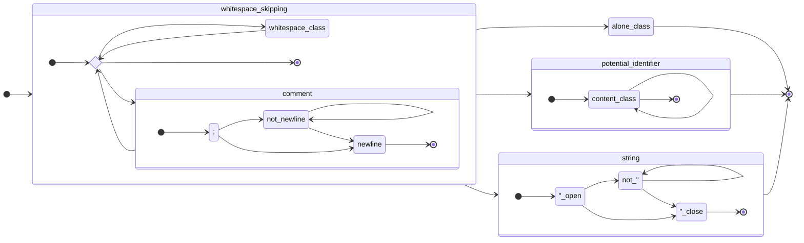

# Datum Specification

"Datum" (working name) is an S-expression format meant for quick implementation in various languages.

Datum decoding is described as a series of layers that starts with a byte stream. *However, if it is actually operating on a byte stream is left ambiguous.*

Therefore, "characters" may here refer to *bytes*, *Unicode codepoints*, or *UTF-16 elements*, and the specification is designed such that it is behaviourally identical regardless of which of these is chosen as the underlying representation.

All references to numeric character values in this specification are unsigned. All references to specific characters are either as per ASCII or UTF-8.

The specification will never require UTF-8 to be decoded, but UTF-8 may need to be encoded, and if the result of the parsing process is not valid UTF-8, the input is formally considered invalid (but may be accepted regardless).

## Why not an R6RS subset?

*No rule in Datum will ever require the decoding of a UTF-8 sequence. Doing so adds unnecessary complexity, tends to discriminate against characters for arbitrary reasons, and above all can create Unicode-version-dependent behaviour due to how the previous two issues are caused.*

- For example, `🨂` is not a valid identifier in Java, the normal C compilers, and Python. There is no particular justifiable reason for this except that Unicode doesn't consider it a letter. If Unicode were to consider it a letter in future, the result could be effectively a version break in Java and Python (the normal C compilers do their own thing here).

- The behaviour of `gcc (Ubuntu 11.3.0-1ubuntu1~22.04) 11.3.0` appears to indicate GCC Unicode identifier compatibility operates by exclusion, i.e. `U+3FF80` is a valid identifier character. Java and Python, meanwhile, consider `U+3FF80` (Unassigned as of Unicode 15.0) invalid, but `U+10400` (Deseret: 𐐀) valid. A hypothetical future Unicode version could therefore enable valid Java and Python identifier characters that past versions refuse to accept for reasons that are, frankly, completely arbitrary. GCC's behaviour, on the other hand, could lead to code becoming invalid on a similar basis. This would be arguably worse if not for that people do not just arbitrarily use unassigned codepoints.

- GCC, Python and Java do consider the *private use areas* as invalid, for some unknown reason. (This rather defeats the purpose of the private use area.)

- ICU soversioning is a complete disaster.

## Encoding

The encoding component converts a stream of characters to a potentially different stream of characters, tagged with a flag known as *direct*.

The backslash, 92 `\`, begins an escape sequence.

The backslash may be followed by any character, in which case the result is that character, but made indirect. However, these specific characters have special meanings:

* 117 `x`: Can be followed by however many hexadecimal digits, of any case, terminated by a semicolon 59 `;`, which indicate a Unicode codepoint to be written indirectly into the character stream.

* 110 `n`: Newline, or 10, written indirectly.

* 114 `r`: Carriage return, or 13, written indirectly.

* 116 `t`: Tab, or 9, written indirectly.

This provides the fundamental escaping logic for the rest of Datum.

All *indirect* (that is, not *direct*) characters should be treated as content-class, bypassing any checks on their value during tokenization. However, the specific characters are still carried through. That is, if a decoded character is 10 indirect (aka the result of `\n`), and that is the only character in the decoded stream, that is an *identifier* whose content is a single newline character.

When the true value of a character should be used, it will be referred to as the *direct value*, and otherwise (when masked as content-class), the *indirect value*. How this works with the characters "written indirectly" above is that the value being written is the true value, and that's then masked as content-class for the indirect value.

While these don't have any meaningful effect on the specification, there are two things worth noting:

1. It is impossible for the backslash to be written as a direct character under this system.

2. As UTF-8-extended bytes (128-255), UTF-16 surrogate pairs, and high codepoints (128+) are _always_ content-class, the direct and indirect distinction effectively does not apply to them. This is on purpose and is the only way the specification can remain interoperable with respect to implementations that do and do not respect UTF-8. In particular, `\` followed by a multi-byte-sequence creates a difference in handling of the direct flag, but as the results are always content-class, it does not actually matter.

## Character Classes

There are a number of character classes defined here, which are defined in terms of the *indirect values*.

- The characters from 0 through 32 inclusive, along with 127, are *whitespace-class*.

- 59 `;`, and 34 `"`, are *special-class*.

- 39 `'`, 40 `(`, and 41 `)`, are *alone-class*.

- All other characters, *including all UTF-8 sequences and high codepoints*, are *content-class*.

## Tokenization

To define tokenization, we must first define the four kinds of token:

1. *Identifiers,* such as `open`, `language_tok` -- *potential identifiers* are simply contiguous lists of content-class characters

2. Numbers, such as `123` -- a subset of potential identifiers described below

3. Strings, such as `"Hello world"` -- double-quotes-delimited sequences of arbitrary characters

4. The individual special tokens `'`, `(` and `)` -- the *quote*, *start-list* and *end-list* tokens

Next, we must define *whitespace*. Whitespace is one of two sequences outside of a string:

1. Any whitespace-class byte.

2. The indirect value 59 `;` terminated by 10 (newline, and included in the sequence).

The tokenization of Datum does not explicitly define the full set of *potential identifiers* that are considered *numbers*. However, some core principles must be followed:

* All potential identifiers that begin with the indirect values of 48 `0` through 57 `9` inclusive or 45 `-` are *reserved number identifiers*.

* Once the distinction has been made that a token is a reserved number identifier, if characters within are direct or indirect ceases to matter. (This is important as parsing of numbers is assumed to be handed off to code that does not care about the direct/indirect distinction.)

* Any reserved number identifier that does not parse as a number must be considered distinct from a regular identifier and preserved as a specific kind of token for potential compatibility workaround code to pick up on. That code may provide an error -- in particular it's not recommended to try and implement these as actual literals in a data model.

* Any reserved number identifier that does parse as a number can be appropriately forwarded as a *numeric token* (realistically, these would be *64-bit integer token* and *64-bit float token*). It is advised to keep the full textual content available, particularly in callback tokenizers where doing so is a zero-cost operation.

In addition, it is generally advised (given the repository this is in) that whatever's given can be parsed by `Long.parseLong` or `Double.parseDouble`.

A chart labelled roughly by indirect values (be aware that these names aren't 1:1, check with the above):

## Grammar

The grammar of Datum is very simple.

Firstly, Datum does not follow JSON's de-facto "one file, one value" rule. Datum inherits from S-expressions the basic idea that a file is a continuous stream of S-expressions that may *choose* to have only one S-expression. This can, but does not (and ideally shouldn't) have to be, considered as a file being one big list.

At the level of this list, any token is valid except for the *end-list token* `)`, which is not valid. The "outer list" is implicit and not real, and there is no context to which list further input would append.

Most tokens are simply literal values of their respective kinds. There are two exceptions:

1. The *start-list token* `(` begins a list, identical to the outer list except for one aspect -- it accepts and ends with the *end-list token*. The entire list is considered to be a value.

2. The *quote token* `'` expects another value immediately afterwards (which may be, but doesn't have to be, a list). The transform is effectively: `'V` becomes `(quote V)`.

*Due to this mode of operation, streaming parsers for Datum are nearly identical to callback tokenizers, with the exception that streaming parsers may report an error if an end-list token is applied when it matches to no start-list token, and that streaming parsers have to deal with the quote token by synthesizing the list.*

## Optional Implementation Requirements

An implementation may (but does not have to) make the following requirements, and all documents in the format must follow these to be valid:

1. That the input stream is valid UTF-8.

2. That all `\u`-escaped codepoints are allowed to be used in UTF-8.

3. That all strings and potential identifiers are valid UTF-8. (The first two points together guarantee this.)

An implementation may also require a lack of null (0) characters at any point, but the document is still valid in this case.
