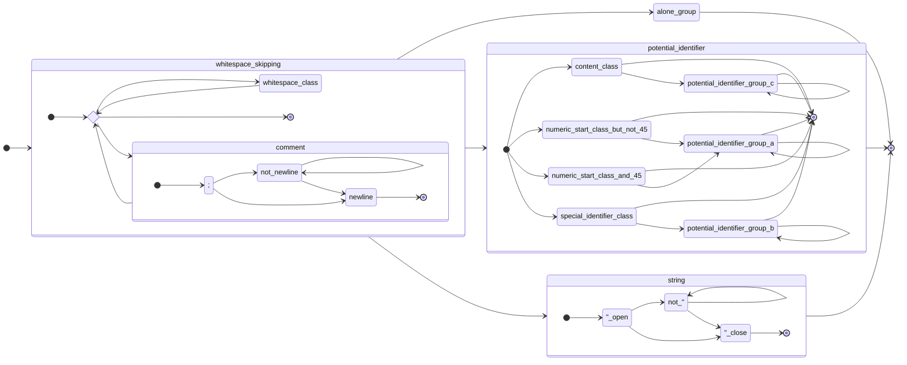

# Datum Specification

"Datum" (working name) is an S-expression format meant for quick implementation in various languages.

It's intended to be reasonably readable by R6RS readers, but not a strict subset (see reasoning below).

Datum decoding is described as a series of layers that starts with a byte stream. *However, if it is actually operating on a byte stream is left ambiguous.*

Therefore, "characters" may here refer to *bytes*, *Unicode codepoints*, or *UTF-16 elements*, and the specification is designed such that it is behaviourally identical regardless of which of these is chosen as the underlying representation for both input and output.

All references to numeric character values in this specification are unsigned. All references to specific characters are either as per ASCII or UTF-8.

The specification will never require UTF-8 to be decoded, but UTF-8 may need to be encoded, and if the result of the parsing process is not valid UTF-8, the input is formally considered invalid (but may be accepted regardless).

## Why not an R6RS subset?

*No rule in Datum will ever require the decoding of a UTF-8 sequence. Doing so adds unnecessary complexity, tends to discriminate against characters for arbitrary reasons, and above all can create Unicode-version-dependent behaviour due to how the previous two issues are caused.*

- For example, `🨂` is not a valid identifier in Java, the normal C compilers, and Python. There is no particular justifiable reason for this except that Unicode doesn't consider it a letter. If Unicode were to consider it a letter in future, the result could be effectively a version break in Java and Python (the normal C compilers do their own thing here).

- The behaviour of `gcc (Ubuntu 11.3.0-1ubuntu1~22.04) 11.3.0` appears to indicate GCC Unicode identifier compatibility operates by exclusion, i.e. `U+3FF80` is a valid identifier character. Java and Python, meanwhile, consider `U+3FF80` (Unassigned as of Unicode 15.0) invalid, but `U+10400` (Deseret: 𐐀) valid. A hypothetical future Unicode version could therefore enable valid Java and Python identifier characters that past versions refuse to accept for reasons that are, frankly, completely arbitrary. GCC's behaviour, on the other hand, could lead to code becoming invalid on a similar basis. This would be arguably worse if not for that people do not just arbitrarily use unassigned codepoints.

- GCC, Python and Java do consider the *private use areas* as invalid, for some unknown reason. (This rather defeats the purpose of the private use area.)

- ICU soversioning is a complete disaster.

## Data Model

The following kinds of values exist:

1. Symbols are arbitrary lists of characters (even empty lists).

2. Strings are arbitrary lists of characters (even empty lists).

3. The range and format of valid numbers is implementation-defined, with specific notes. What you're allowed to do here is restrained by Potential Identifier Differentiation, but the specific notes cover doubles and 64-bit integers.

4. The valid Special Identifiers and their meanings are implementation-defined, with specific notes. What you're allowed to do here is restrained by Potential Identifier Differentiation, but the specific notes cover 64-bit integers.

5. Lists can have any number of, or no, elements.

## Encoding

The encoding component converts a stream of characters to a potentially different stream of characters, tagged with *character classes*.

Later stages use character classes to control behaviour.

If, in this stage, a character is described as being written *indirectly,* then the class is always *content-class*. Otherwise, the class is determined by the Character Classes section.

The backslash, 92 `\`, begins an escape sequence.

The backslash may be followed by any character, in which case the result is that character, but made indirect. However, these specific characters have special meanings:

* 117 `x`: Can be followed by however many hexadecimal digits, of any case, terminated by a semicolon 59 `;`, which indicate a Unicode codepoint to be written indirectly into the character stream.

* 110 `n`: Newline, or 10, written indirectly.

* 114 `r`: Carriage return, or 13, written indirectly.

* 116 `t`: Tab, or 9, written indirectly.

This provides the fundamental escaping logic for the rest of Datum.

While these don't have any meaningful effect on the specification, there are two things worth noting:

1. It is impossible for the backslash to be written as a direct character under this system.

2. As UTF-8-extended bytes (128-255), UTF-16 surrogate pairs, and high codepoints (128+) are _always_ content-class, the direct and indirect distinction effectively does not apply to them. This is on purpose and is the only way the specification can remain interoperable with respect to implementations that do and do not respect UTF-8. In particular, `\` followed by a multi-byte-sequence creates a difference in handling of the direct flag, but as the results are always content-class, it does not actually matter.

## Character Classes

There are a number of character classes defined here, defined in terms of character values.

All characters within a class act behaviourally identical to each other as far as later stages are concerned.

- The characters from 0 through 32 inclusive, along with 127, but *not* 10, are *whitespace-class*.

- 10 is *newline-class*.

- 59 `;` is *line-comment-class*.

- 34 `"` is *string-class*.

- 39 `'` is *quote-class*.

- 40 `(` is *list-start-class*.

- 41 `)` is *list-end-class*.

- 41 `#` is *special-identifier-class*.

- 48 `0` through 57 `9` inclusive, or 45 `-`, are *numeric-start-class*.

- All other characters, *including all characters (UTF-8, UTF-16, Unicode, or otherwise) above 127,* are *content-class*.

There are also the following groups of classes, the contents of which may be differentiated by their actual class later:

- The union of *content-class*, *numeric-start-class*, and *special-identifier-class* make up the *potential-identifier-group*.

- The union of *whitespace-class* and *newline-class* make up the *non-printing-group*.

- The union of *quote-class*, *list-start-class*, and *list-end-class* make up the *alone-group*.

These groups only exist for ease of specification writing and their existence does not modify the character class process.

## Tokenization

### Whitespace

First, we must define *whitespace*. Whitespace is one of two sequences outside of a string:

1. Any *non-printing-group* character.

2. A *line-comment-class* character followed by an arbitrary sequence of characters ending with a *newline-class* character, which is considered included in the sequence.

Before reading a token, any whitespace is consumed.

### Token Types

There are a few kinds of token at this stage:

* *Symbol tokens,* a *content-class* character followed by an arbitrary number of *potential-identifier-class* characters, *or* a token that solely consists of a single 45 `-` character of *numeric-start-class.* Examples: `-`, `hello`, `symbol->string`.
  
  * The `-` token is a special case of Numeric token parsing and is theoretically handled after parsing of a Numeric token completes.

* *Numeric tokens,* a *numeric-start-class* character followed by an arbitrary number of *potential-identifier-class* characters, *unless* the token would solely consist of a single 45 `-` character (see *Symbol tokens*). Examples: `12.3`, `-8`.

* *Special Identifier tokens,* a *special-identifier-class* character followed by an arbitrary number of *potential-identifier-class* characters. Example: `#t`.

* *String tokens,* *string-class*-delimited sequences of completely arbitrary characters. The only restriction is that in order to write characters 34 `"` or 92 `\`, they must be escaped.

* Characters of the *alone-group* turn into specific token types for each of the group's classes:
  
  * *quote-class* characters become *Quote tokens.*
  
  * *list-start-class* characters become *List Start tokens.*
  
  * *list-end-class* characters become *List End tokens.*

It is worth mentioning the expected parsing strategy here. In essence, *Symbol tokens, Numeric tokens,* and *Special Identifier tokens* are expected to be parsed more or less by the same routine with some flags set.

**After this point, the direct/indirect and character class distinctions cease to exist.**

### Chart

A chart labelled roughly by indirect values (be aware that these names aren't 1:1, check with the above):



## Tokens To Values

*Symbol tokens, Numeric tokens,* and *Special Identifier tokens* as described above do not make up the basic primitive types such as booleans, integers, and floats.

As such, it falls to this part of the specification to explain how these are divided.

### Symbols

There is nothing particularly special to note about symbols -- they can be thought of as essentially strings with a special flag set.

However, it *may* be of use to optimize them in some way for fast lookup/comparison (perhaps interning them).

### Special Identifiers

Special identifiers are situational. *Above all else, their purpose is to represent arbitrary singleton values that can't be arbitrarily defined by the user.*

The receiving parser must define them, or forward the task onto the calling code in some way. Ideally the calling code should be able to choose either.

They should be used with care; while Datum is intended to be written by humans (not for machine-to-machine transfer), some special identifiers may not be available in all contexts.

As such, if defining a format based on Datum, reliance on these special identifiers may create awkward results.

Usage of special identifiers other than `#f` and `#t` also heavily limits cross-compatibility with Scheme parsers -- `#{}#` is a Guile extension, and neither that or `#nil` are available on Scheme 9 from Empty Space, for instance.

However, the following special identifiers shall be considered *standardized* and should only be used for their intended purposes. *If at all possible, a parser should implement these unless special identifier parsing is overridden. Implementations should default to what contextually makes sense, but must allow overriding the logic if any standard values are aliased in a non-standard way.*

This list also gives examples of how this might map to Scheme 9 From Empty Space, as an example of how interoperability works here.

* `#{}#`: This is actually converted into the empty symbol. This mainly exists to remove some of the error cases from writers.
  
  * Scheme interop notes: Won't parse on S9FES. Custom parser could use `(string->symbol "")`.

* `#t` and `#T`: These express the boolean `true` value.
  
  * Scheme interop notes: Should parse on all Schemes.

* `#f` and `#F`: These express the boolean `false` value.
  
  * Scheme interop notes: Should parse on all Schemes.

* `#nil` or any case variation: This represents `null` or so forth. This may or may not be an alias for `()` depending on context.
  
  * Scheme interop notes: Won't parse on S9FES. A custom parser could alias it to `()` or define a unique signal value kind of like how `eof-object?` works.

* `#i+inf.0` or any case variation: Positive infinity.
  
  * Scheme interop notes: Won't parse on S9FES.

* `#i-inf.0`or any case variation: Negative infinity.
  
  * Scheme interop notes: Won't parse on S9FES.

* `#i+nan.0`or any case variation: Positive NaN.
  
  - Scheme interop notes: Won't parse on S9FES.

### Numbers

The tokenization of Datum does not explicitly define the full set of *Numeric tokens* that are considered *numbers*. However, there are two groups of considerations here.

Firstly, the standard formats:

- The standard integer format, which *must* be supported:
  
  - This is any contiguous sequence of the 10 ASCII decimal digits, which may or may not be preceded by 45 `-` or 43 `+` (*this should rarely come up due to how parsing has been defined but is important*).
    - If the result exceeds the integer limits of the implementation, the results are undefined.
  - If the source data model makes no distinction whatsoever between floating point and integer values (i.e. it doesn't have integers, period), this format *should* be used whenever it would not lose precision, unless specified otherwise.

- The standard floating-point format. If floating point values are supported by the implementation, this format *must* be supported:
  
  - This is the standard integer format, followed immediately by 46 `.` and then another contiguous sequence of the 10 ASCII decimal digits, such as `0.0` (this does not cover, say, `0.` or `.0`).

- The standard floating-point scientific notation format. This format *should* be supported:
  
  - This is the standard integer or floating-point format, followed immediately by 101 `e` or 69 `E`, followed by the standard integer format *again.*
  - *Unfortunately, most programming language standard libraries will use this format under some set of conditions, and they make it rather difficult to override.*
    - It is possible to write a string processing function that fixes these, but doing so also goes somewhat against the minimal-implementation ideals of Datum.
      - In addition, `1e+308` is representable as a 64-bit floating-point number. The implication is that the results may be... amusing.
  - This format *should never be written by humans.*

These three formats are the mutual ground between most programming language's default integer and floating-point parsing and printing functions.

However, do be sure that your language of choice does not print 'abnormal' forms outside of this (this is a particular danger for floating-point values, but can mainly be averted by checking for NaNs and infinities).

Secondly, things to consider:

* It is advised to keep the full textual content available, particularly in callback tokenizers where doing so is a zero-cost operation.

* Any reserved number identifier that does not parse as a number must be considered a distinct kind of value, and should be available via some hook for potential compatibility workaround code to pick up on.
  
  * The default handling, or that code, may provide an error -- in particular it's not recommended to try and implement these as actual literals in a tree data model unless you really need to load _any_ valid file. A visitor model might expose the information with a default implementation that throws an error.

* Using 44 `,`  in a real floating-point or real integer number is *never* valid. This is to avoid the "10,000 => 10000 or 10.000" problem between different cultures. Just don't. Do not do it.
  
  * Using it as part of a special kind of number not *expected* to be generally readable (Numeric vectors, complex numbers, possibly rational numbers but those would do better to use `/`) is theoretically fine, though an implementation should give some idea of the format of what such a number is, and the implementer may still wish to consider using alternative methods of expressing the number, *as the resulting format will be highly implementation-specific.*

In addition, it is *generally advised* (given the repository this is in) that whatever number format is used for writing follows the JSON specification, and can be parsed by Java `Long.parseLong` or `Double.parseDouble`; further, that the reader can handle the values that come from those functions, such as hexadecimal (`0x100` = `256`) and scientific notation, *but these formats shouldn't be machine-written as an R6RS parser (or Guile, even!) cannot handle it.*

*A particular exception to this arises with infinities and NaNs.* These need to go into special identifier territory, because the Scheme syntax for them is a massive pile of special cases that overextends way too far into symbol territory. Luckily, R6RS introduces syntax for these, and the inexact-prefix version works nicely.

*Also, to be absolutely clear: only the 'standard formats' described above, along with the special identifiers, are safe to use for writing; use of a custom number format makes the file not purely Datum standard, and a compliant parser may not parse the result correctly.*

## Grammar

The grammar of Datum is very simple.

Firstly, Datum does not follow JSON's de-facto "one file, one value" rule. Datum inherits from S-expressions the basic idea that a file is a continuous stream of S-expressions that may *choose* to have only one S-expression. This can, but does not (and ideally shouldn't) have to be, considered as a file being one big list.

At the level of this list, any token is valid except for the *end-list token* `)`, which is not valid. The "outer list" is implicit and not real, and there is no context to which list further input would append.

Most tokens are simply literal values of their respective kinds. There are two exceptions:

1. The *start-list token* `(` begins a list, identical to the outer list except for one aspect -- it accepts and ends with the *end-list token*. The entire list is considered to be a value.

2. The *quote token* `'` expects another value immediately afterwards (which may be, but doesn't have to be, a list). The transform is effectively: `'V` becomes `(quote V)`. Note that how this token is *used* is dependent on format (see the JSON Transformation below for an example of an arguably abnormal use of it that nonetheless improves the format).

*Due to this mode of operation, streaming parsers for Datum are nearly identical to callback tokenizers, with the exception that streaming parsers may report an error if an end-list token is applied when it matches to no start-list token, and that streaming parsers have to deal with the quote token by synthesizing the list.*

## Optional Implementation Requirements

An implementation may (but does not have to) make the following requirements, and all documents in the format must follow these to be valid:

1. That the input stream is valid UTF-8.

2. That all `\u`-escaped codepoints are allowed to be used in UTF-8.

3. That all strings and potential identifiers are valid UTF-8. (The first two points together guarantee this.)

An implementation may also require a lack of null (0) characters at any point, but the document is still valid in this case. This requirement upsets the ability to represent partially-ASCII byte streams as Unicode codepoints 0 through 255, but implementations in languages that would concern themselves with null bytes do not have UTF-8 decoding as a certainty in a minimalist implementation, and therefore it is up to the implementer to determine the appropriate path. *This is worth noting especially because this affects file formats layered onto Datum.*

## JSON Transformation

The full JSON transformation shows methods to fit different data models to Datum.

To transform JSON into Datum (and vice versa), the following rules should be followed:

1. Each JSON value is a single Datum value. This preserves the property that a JSON stream becomes a Datum stream and vice versa.

2. Booleans are `#f` and `#t`.

3. Numbers are represented exactly as they are in JSON.

4. Strings undergo a change in escaping, but due to the rules above this will never require _decoding UTF-8_ (as long as one is willing to allow that arbitrary UTF-8 directly into the output stream without directly escaping it).

5. When reversing the transformation, if a symbol is used where not expected, it should be converted to a string.

6. Null is translated into `#nil`.

7. Arrays are translated directly into a list, i.e. `[1, 2, 3]` becomes `(1 2 3)`.

This doesn't cover objects, as there's no reasonable *direct* translation.

A full JSON translation adds an additional rule:

Objects use the quote symbol to indicate the difference between them and lists, and use a list of key/value pairs (the pairs written without any framing). For example, `{"1a": 1, "b": "2"}` becomes `'("1a" 1 "b" "2")`.

This is not ambiguous, as symbols at the start of a list should not appear outside of objects in this transformation (and this is only to help with typing anyway). It is slightly unusual (as this expands to `(quote ("1a" 1 b "2"))`), but is easier to type than other forms.

Another way to represent this could have been, for instance, to have `(obj)` be the empty object, and `(obj "1a" 1 b 2)` be the example object given above. This wasn't chosen as using the quote character here made typing a lot easier.

## KeyValues Transformation

This will not be fully specified here, but exists more to illustrate a point about the use of the stream style.

KeyValues uses key/value pairs, but handles arrays by simply giving elements in them the same, repeated key.

This in mind, one can imagine the following KeyValues:

```
example {
    a b
}
```

becoming the following:

```
example (
    a "b"
)
```

There isn't really much more to say about this -- the translation only has the same problems as the JSON translation above.
